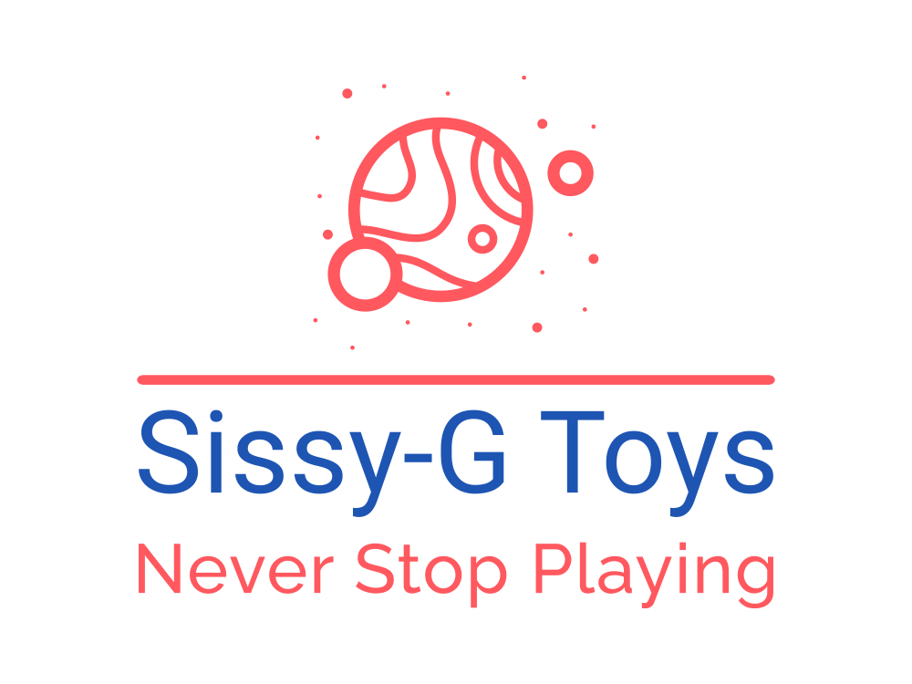
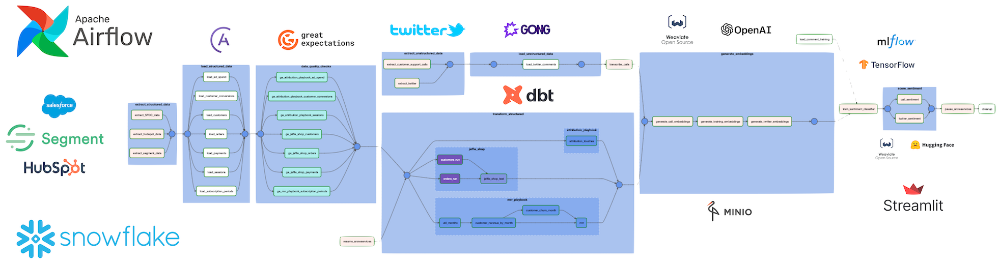
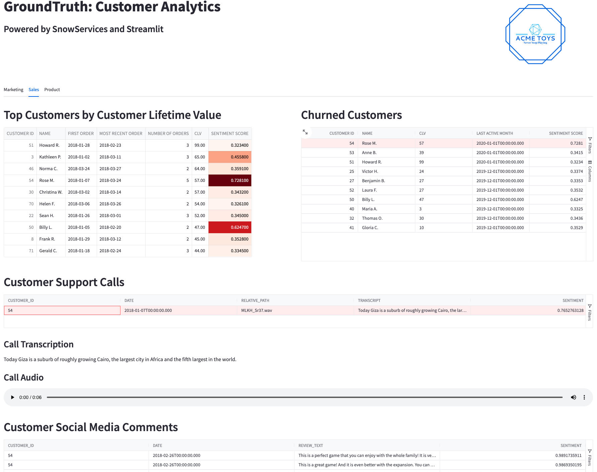

  
<sub><sup>Sissy-G ~= [Syzygy](https://en.wikipedia.org/wiki/Syzygy) /ˈsɪzɪdʒi/ ASTRONOMY the alignment of three or more celestial bodies.</sup></sub>


Overview
========
This demonstration shows an Airflow integration for Snowflake's Snowpark Containers.  Sissy-G Toys is an online retailer for toys and games.  The GroundTruth customer analytics application provides marketing, sales and product managers with a one-stop-shop for analytics.  The application uses machine learning models for audio transcription, natural language embeddings and sentiment analysis on structured, semi-structured and unstructured data. 
  
  
  

This workflow includes:
- sourcing structured, unstructured and semistructured data from different systems
- ingest with Astronomer's [python SDK for Airflow](https://github.com/astronomer/astro-sdk)
- data quality checks with [Great Expectations](https://greatexpectations.io/)
- transformations and tests in [DBT](https://www.getdbt.com/), 
- audio file transcription with [OpenAI Whisper](https://github.com/openai/whisper)
- natural language embeddings with [OpenAI Embeddings](https://platform.openai.com/docs/guides/embeddings)
- vector search and named-entity recognition with [Weaviate](https://weaviate.io/)
- sentiment classification with [Keras](https://keras.io/)  
- ML model management with [Snowflake ML](https://docs.snowflake.com/LIMITEDACCESS/snowflake-ml-modeling)
  
All of the above are presented in a [Streamlit](http://www.streamlit.io) applicaiton.  
  


  
   
  
Project Contents
================

Your Astro project contains the following files and folders:

- dags: This folder contains the Python files for the Airflow DAG. 
- Dockerfile: This file contains a versioned Astro Runtime Docker image that provides a differentiated Airflow experience. If you want to execute other commands or overrides at runtime, specify them here.
- include: This folder contains additional directories for the Snowpark Container services that will be built in the demo. Services included in this demo include:
    - Airflow Snowpark Container Runner: This application runs in a Snowpark container and listens for tasks to execute. This allows Airflow users to execute tasks on Snowpark Container compute with security, scalability and specialized compute (ie. GPUs). 
    - [minio](https://min.io/): Object storage which is used for ingest staging as well as stateful backups for other services.  As an alternative to S3 or GCS this service is controlled by the user and provides a local option keeping data inside Snowflake.
    - [snowpark-ml](https://docs.snowflake.com/en/developer-guide/snowpark-ml/index): Snowflake Preprocessing, Feature Engineering and Model Registry frameworks for machine learning.
    - [weaviate](https://weaviate.io/): A vector database 
    - [streamlit](http://www.streamlit.io): A web application framework for building data-centric apps.

Each service includes a snowpark_container_spec.yml file which specifies service details for both local development mode and for running the service in Snowpark Containers. A snowpark_container_spec_TEMPLATE.yml file has been provided to assist in creating additional services. 
- packages.txt: Install OS-level packages needed for the project.
- requirements.txt: Install Python packages needed for the project.
- plugins: Add custom or community plugins for your project to this file. It is empty by default.
- airflow_settings.yaml: Use this local-only file to specify Airflow Connections, Variables, and Pools instead of entering them in the Airflow UI as you develop DAGs in this project.

Deploy Your Project Locally
===========================

The [Astronomer Provider for Snowflake](https://github.com/astronomer/astro-provider-snowflake) includes a hook to manage the CRUD operations of Snowpark Containers.  Additionally it provides a local development mode which allows users to build containers locally with Docker for local unit testing before deploying to Snowpark Containers.

Prerequisites:
Docker Desktop or similar Docker services running locally with the docker CLI installed.  
Astronomer account or [Trial Account](https://www.astronomer.io/try-astro/) (optional)
Snowflake account or [Trial Account](https://signup.snowflake.com/)
OpenAI account or [Trial Account](https://platform.openai.com/signup)
  
### Open a Terminal window for the following steps.
  
1. Install Astronomer's [Astro CLI](https://github.com/astronomer/astro-cli).  The Astro CLI is an Apache 2.0 licensed, open-source tool for building Airflow instances and is the fastest and easiest way to be up and running with Airflow in minutes. Open a terminal window and run:

For MacOS  
```bash
brew install astro
```
  
For Linux
```bash
curl -sSL install.astronomer.io | sudo bash -s
```

2. Clone this repository.  
```bash
git clone https://github.com/astronomer/airflow-snowpark-containers-demo
cd airflow-snowpark-containers-demo
```
  
3.  Setup shell environment variables for the demo.  Update values in brackets `<>` and run the commands in the terminal where you will be running the demo.

- Export database and schema to be used for this demo.  If these objects do not yet exist they can be created in a later step.
```bash
export DEMO_DATABASE='<DB_NAME>'
export DEMO_SCHEMA='<SCHEMA_NAME>'
export OPENAI_APIKEY='<OPENAI_APIKEY>'
```

-Export Snowflake account credentials as environment variables.
```bash
export AIRFLOW_CONN_SNOWFLAKE_DEFAULT='{"conn_type": "snowflake", "login": "<USER_NAME>", "password": "<PASSWORD>", "schema": "${DEMO_SCHEMA}", "extra": {"account": "<ORG_NAME>-<ACCOUNT_NAME>", "warehouse": "<WAREHOUSE_NAME>", "database": "${DEMO_DATABASE}", "region": "<REGION_NAME>", "role": "<USER_ROLE>", "authenticator": "snowflake", "session_parameters": null, "application": "AIRFLOW"}}'
```

__NOTE__: The ACCOUNT field of the connection string should use the new <ORG_NAME>-<ACCOUNT_NAME> format as per [Snowflake Account Identifier policies.](https://docs.snowflake.com/en/user-guide/admin-account-identifier)  Snowpark Containers are not supported with the legacy account identifiers (ie. xxx111111.prod1.us-west-2.aws )

4.  The Astro CLI uses Docker Compose to create local development resources in addition to the Airflow services. 

Start a local Apache Airflow instance along with the services listed above.
```bash
astro dev start
```
  
5. For private preview it is necessary to enable OAUTH services for the Snowflake account.  Run the following with `ACCOUNTADMIN` privileges:
```sql
CREATE SECURITY INTEGRATION snowservices_ingress_oauth
TYPE=oauth
OAUTH_CLIENT=snowservices_ingress
ENABLED=true;
```
  
6. Setup Snowflake objects for the demo.  
  
Create a Python virtual environment to run the setup steps.
```bash
pip install virtualenv
python -m virtualenv snowpark_containers_venv
source snowpark_containers_venv/bin/activate 
pip install './include/astro_provider_snowflake-0.0.0-py3-none-any.whl[docker]'
python
```
Create databases, schemas and grant permissions.  Note, this must be run as a user with admin priveleges.  The user credentials specified in `AIRFLOW_CONN_SNOWFLAKE_DEFAULT` must be able to assume the sysadmin role.  Alternatively provide the SQL commands below to a system administrator who can run them.
```python
from astronomer.providers.snowflake.hooks.snowpark import SnowparkContainersHook
import os
hook = SnowparkContainersHook('snowflake_default')
user_role = hook.conn_params['role']
demo_database = os.environ['DEMO_DATABASE']
demo_schema = os.environ['DEMO_SCHEMA']
hook.role = 'sysadmin'

hook.run(f"""CREATE DATABASE IF NOT EXISTS {demo_database};
              CREATE SCHEMA IF NOT EXISTS {demo_database}.{demo_schema};
              GRANT CREATE COMPUTE POOL ON ACCOUNT TO ROLE {user_role};
              GRANT CREATE IMAGE REPOSITORY ON SCHEMA {demo_database}.{demo_schema} TO ROLE {user_role}; 
              GRANT CREATE SERVICE ON SCHEMA {demo_database}.{demo_schema} TO ROLE {user_role};
              GRANT USAGE ON DATABASE {demo_database} TO ROLE {user_role};
              GRANT USAGE ON SCHEMA {demo_database}.{demo_schema} TO ROLE {user_role};
              GRANT CREATE SCHEMA ON DATABASE {demo_database} TO ROLE {user_role};
              GRANT CREATE TABLE ON SCHEMA {demo_database}.{demo_schema} TO ROLE {user_role};
              GRANT CREATE VIEW ON SCHEMA {demo_database}.{demo_schema} TO ROLE {user_role};
              GRANT CREATE STAGE ON SCHEMA {demo_database}.{demo_schema} TO ROLE {user_role};
        """)
```  
Setup the table and stage to be used as the Snowflake XCOM backend.
```python
xcom_table='XCOM_TABLE'
xcom_stage='XCOM_STAGE'

hook.run(f"""CREATE OR REPLACE STAGE {demo_database}.{demo_schema}.{xcom_stage} DIRECTORY = (ENABLE = TRUE) ENCRYPTION = (TYPE = 'SNOWFLAKE_SSE');
             CREATE OR REPLACE TABLE {demo_database}.{demo_schema}.{xcom_table} 
              ( dag_id varchar NOT NULL, 
                task_id varchar NOT NULL, 
                run_id varchar NOT NULL,
                multi_index integer NOT NULL,
                key varchar NOT NULL,
                value_type varchar NOT NULL,
                value varchar NOT NULL); 
              GRANT USAGE ON DATABASE {demo_database} TO ROLE {user_role};
              GRANT USAGE ON SCHEMA {demo_database}.{demo_schema} TO ROLE {user_role};
              GRANT CREATE TABLE ON SCHEMA {demo_database}.{demo_schema} TO ROLE {user_role};
              GRANT SELECT, INSERT, UPDATE ON TABLE {demo_database}.{demo_schema}.{xcom_table} TO ROLE {user_role};
              GRANT READ, WRITE ON STAGE {demo_database}.{demo_schema}.{xcom_stage} TO ROLE {user_role};
        """)
quit()
```

7. Run the Airflow Customer Analytics DAG in the Airflow UI 
```bash
astro dev run dags unpause customer_analytics
astro dev run dags trigger customer_analytics
```
Follow the status of the DAG run in the [Airflow UI](http://localhost:8080/dags/customer_analytics/grid) (username: `admin`, password: `admin`)
    
8. After the DAG completes open the [streamlit application](http://localhost:8501)

Other service UIs are available at the the following:
- Airflow: [http://localhost:8080](http://localhost:8080) Username:Password is admin:admin
- Grafana: [http://localhost:3000](http://localhost:3000)  Username:Password is admin:admin
- Minio: [http://localhost:9000](http://localhost:9000) Username:Password is minioadmin:minioadmin
- Weaviate: [https://console.weaviate.io/](https://link.weaviate.io/3UD9H8z) Enter localhost:8081 in the "Self-hosted Weaviate" field.

9. In the Airflow logs for tasks running in the Airflow Task Runner (ie. the generate_training_embeddings task) you will see that the tasks are running in the local runner.  For example:
```text
__________________________________
Running function generate_training_embeddings in Snowpark Containers 
Task: unstructured_data.generate_embeddings.generate_training_embeddings
Airflow Task Runner: http://airflow-task-runner:8001/task
__________________________________
```

10. Now that everything is running properly in local containers setup services to run in Snowpark Containers.
  
If you are running on a non-x86 system (ie. Mac M1/M2) the containers built (in the background) by Astro CLI will need to be rebuilt for x86 architecture in order to run in Snowpark Containers.
```bash
docker buildx build --load --platform linux/amd64 -t airflow-runner:amd64 include/airflow_task_runner
docker buildx build --load --platform linux/amd64 -t sissyg-streamlit:amd64 include/streamlit
```
Alternatively, if the containers were built on an x86 system they only need to be retagged.
```bash
docker tag airflow-runner:local airflow-runner:amd64
docker tag sissyg-streamlit:local sissyg-streamlit:amd64
```
  
11. Use the SnowparkContainersHook to setup the Snowpark Containers compute pool and image reposity, and push the container images to the repository.

Each Snowpark Container Service is instantiated from a spec file.  For this demo the spec file is in `include/snowpark_containers_spec.yml`. This will be used by the hook to push images as well as creation, update and deletion of the services.

- Add the OpenAI api key for the streamlit service container.  Edit line 20 of the file `include/snowpark_containers_spec.yml` and update the `OPENAI_APIKEY` environment variable with your key (from step 3).

The `push_images` command requires docker which cannot be run from inside a docker container (as the Airflow Scheduler).  Therefore these commands must be run from local python kernel where you installed the astro_provider_snowflake (in step 10).

In the python shell from the previous step run the following: 

```python
from astronomer.providers.snowflake.hooks.snowpark import SnowparkContainersHook
import os
demo_database = os.environ['DEMO_DATABASE']
demo_schema = os.environ['DEMO_SCHEMA']
hook = SnowparkContainersHook('snowflake_default')

repository_name = hook.create_repository(repository_name='sissyg')

pool_name = hook.create_pool(pool_name='sissyg', min_nodes=1, max_nodes=1, replace_existing=False)
  
hook.push_images(service_name='sissyg',
                 database=demo_database,
                 schema=demo_schema,
                 repository_name=repository_name,
                 spec_file_name=f'include/snowpark_container_spec.yml')

hook.create_service(repository_name=repository_name, 
                    pool_name=pool_name, 
                    spec_file_name=f'include/snowpark_container_spec.yml', 
                    min_inst=1,
                    max_inst=1,
                    replace_existing=True)

```

The Astro Airflow instance running in dev mode will be able to run tasks in Snowpark Containers Airflow Task Runner.  

12. Open the `dags/customer_analytics.py` file and change the line `_LOCAL_MODE = True` to `_LOCAL_MODE = False`

13. In the [Airflow Web UI](http://localhost:8080) trigger the customer_analytics DAG via the 'play' button in the top right corner.  This time when the DAG runs it will push down not only all of the SQL commands to run in Snowflake but also all of the SnowparkContainers python tasks will run in the Airflow runner.

